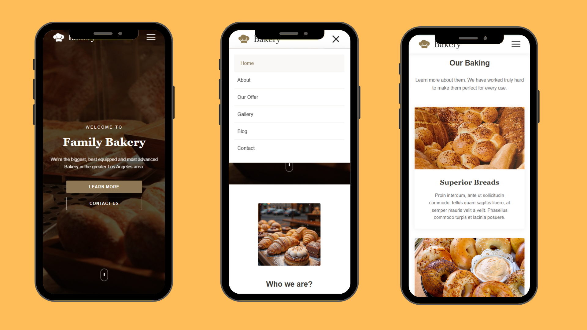

# 🍞 Bakery Website

A fully responsive bakery landing page built using **HTML5**, **CSS3**, and **Vanilla JavaScript** without using any CSS framework.

---

# Preview

## Home Section


---

## Our Baking Section


---

## Mobile View




---

# What I Used in This Assignmnet

## Semantic HTML

- Used semantic elements such as `header`, `nav`, `section`, `main`, and `footer` to organize the page structure and improve readability.

---

## Flexbox

I used **Flexbox** to build almost all layouts.

Examples:

- Aligning the logo and navigation links.
- Creating two-column layouts.
- Building the baking cards.
- Organizing the footer columns.
- Centering content inside the Hero section.

Using Flexbox made the layout responsive without complicated positioning.

---

## CSS Variables

Created reusable variables for colors and transitions.

```css
:root{
    --main-color:#8e7754;
    --dark:#403d38;
    --light:#f8f8f8;
    --text:#686868;
}
```

This allows changing the website theme from one place.

---

## Hero Section

- Used `background-image` for the hero background.
- Used `background-size: cover` to fill the entire section.
- Added a dark overlay using `::before` to improve text readability.
- Centered all content using Flexbox.

---

## Navigation Bar

The navigation bar was built using Flexbox.

I also implemented:

- Sticky navigation while scrolling.
- Background color changes after scrolling.
- Logo switching between two images.
- Active navigation link highlighting.

---

## Responsive Design

Used Media Queries to make the website responsive.

```css
@media (max-width:992px)

@media (max-width:768px)

@media (max-width:576px)
```

The layout automatically changes for tablets and mobile devices.

---

## CSS Transitions & Hover Effects

Used `transition` to create smooth animations for:

- Navigation links
- Buttons
- Product cards
- Social media icons

Also used `transform` to create hover effects on cards.

---

## CSS Animation

Created a CSS animation for the scroll indicator using `@keyframes`.

This adds a simple interactive effect without JavaScript.

---

## Font Awesome

Used Font Awesome icons for:

- Features
- Contact information
- Social media
- Navigation icons

---

## JavaScript

Used Vanilla JavaScript to add interactivity:

- Mobile menu toggle.
- Sticky navbar.
- Change navbar background on scroll.
- Switch logo while scrolling.
- Highlight the active navigation link.
- Close the mobile menu automatically.
- Prevent background scrolling when the mobile menu is open.

---

# Responsive Breakpoints

| Screen | Width |
|---------|-------|
| Desktop | > 992px |
| Tablet | 768px – 992px |
| Mobile | 576px – 768px |
| Small Mobile | < 576px |

---

#  Demo

<p align="center">
    
</p>

---
# How to Run

Clone the repository

```bash
git clone https://github.com/YassminAhmed10/NTI_Assignment2.git
```

Then open **index.html** in your browser.
